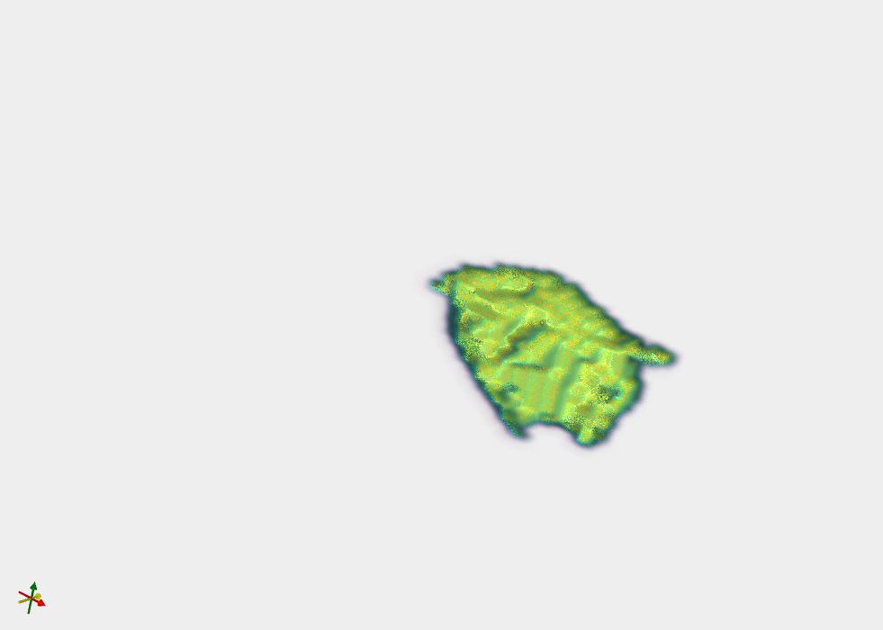
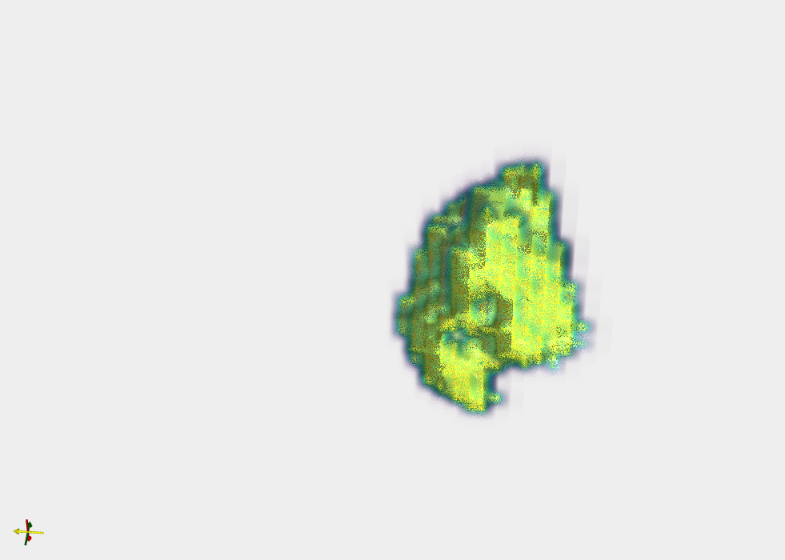

# ITKVTK_PROJECT

AUTHORS : adam.ismaili, scott.tallec, alexandre.netchaev

# Introduction

Dans le cadre de l’étude longitudinale de l’évolution d’une tumeur, il nous a été fourni deux scans sous la forme d’images 3D effectués sur un même patient à des dates différentes.

Pour le traitement de nos images 3D, nous avons dégagé deux parties majeurs à implémenter :
Le recalage : Cette partie consiste à aligner nos images suivant un même système de coordonnées.
La segmentation : Cette partie consiste à isoler la tumeur du reste de l’image, pour nos deux images 3D.

Nous avons enfin terminé par l’analyse de nos résultats suivant plusieurs métriques pour déterminer l’évolution de la tumeur entre nos deux images.

# Recalage

Nous avons remarqué qu’il existe une différence d'alignement latéral entre nos deux images.

Ainsi, l’algorithme de recalage utilisé aligne nos deux images par une transformation de translation en 3D.

Cet algorithme automatique utilise un optimiseur de descente de gradient pour trouver la meilleure transformation qui maximise la similarité entre les images, similarité évaluée à l'aide d'une métrique basée sur les moindres carrés.

Les paramètres utilisées pour l’optimiseur sont :

Taux d’apprentissage : 1
Ecart minimum entre chaque pas : 1e-6
Nombre d’itération : 100

La transformation initiale voit ses paramètres être nuls, et le recalage est effectué en optimisant progressivement les paramètres de translation.

Une fois le recalage terminé, les paramètres de translation, le nombre d'itérations et la valeur de métrique sont affichés pour vérifier que nos résultats soient corrects.

L'image mobile est ensuite ré-échantillonnée pour l'aligner spatialement sur l'image fixe en utilisant la transformation finale obtenue.

Nous avons cependant rencontré quelques difficultés lors de cet étape, notamment en ce qui concerne la compréhension des étapes de recalage et des objets ITK manipulés.

Certaines méthodes, pour pouvoir fonctionner avec des images 3D, nécessitent d’ailleurs de modifier explicitement leurs types templatés, chose que nous avons mis un peu de temps à comprendre.

# Segmentation

L'algorithme de segmentation utilisé est un filtre d'image par seuillage connecté. Il s'agit d'une méthode de segmentation semi-automatique qui permet de segmenter une région d'intérêt dans une image en utilisant des seuils spécifiques.

On a précisé le seuil supérieur et inférieur pour délimiter l’intensité des voxels de la tumeur, ainsi que la position d’un voxel de départ appartenant à la tumeur, appelée “seed”, à l'aide des coordonnées de la tumeur observée dans l'image. Nous calculons ses coordonnées avec l'outil 3D Slicer qui permet de facilement visualiser le cerveau et de localiser la tumeur.

Seuils et position de la seed pour nos deux images :

lower_threshold = 500.
upper_threshold = 800.
seed_position = (90, 70, 51)

L'algorithme va ensuite permettre à la segmentation de se propager à partir de la seed dans l'image, en examinant les voxels voisins. Si la valeur d'un voxel voisin est comprise entre les seuils inférieur et supérieur, ce voxel est considéré comme faisant partie de la région d'intérêt et est étiqueté avec une valeur spécifique.

Nous avons cependant rencontré quelques difficultés lors de cette étape notamment car nous avions voulu convertir les arrays obtenus en png puis l’envoyer à l’algorithme. Cependant la scalar range, ainsi que les valeurs de l’image en devenaient fortement altérées empêchant ainsi une propagation efficace de l’algorithme.
Trouver une application nous permettant d’efficacement analyser le cerveau a été très utile également, souhaitant au départ trouver la seed manuellement.

# Visualisation et Comparaison des résultats

Lors de cette partie, nous nous sommes d’abord trompé sur ce qu’on considérait être une tumeur.

Le patient présente en effet un trou dans un des hémisphères de son cerveau que nous avons assimilé à la tumeur. Après avoir trouvé des mesures incohérentes, nous avons compris que la tumeur se trouve être les parties blanches sur l’image en niveau de gris autour de ce trou.

Le patient semble avoir subi une première opération pour retirer une partie de la tumeur. Nous en avons déduit que la première image était celle du patient quelque temps après l’opération, et la seconde une image prise plus longtemps après.

Nous avons donc relocalisé la détection de la tumeur où le résultat nous semblait plus cohérent.

Voici les résultats obtenus :

Avant:

Volume de la tumeur segmentée : 8026.0
Intensité moyenne de la tumeur segmentée : 0.17743804

Après 6 mois:

Volume de la tumeur segmentée : 8524.0
Intensité moyenne de la tumeur segmentée : 0.18844777

# Conclusion

Avec ce projet, nous avons pu expérimenter avec ITK majoritairement (et rapidement VTK pour la visualisation). C’est un outil très fort dans le domaine médical et de la segmentation, donnant des résultats plus que satisfaisant, la “seule difficulté” étant d’adapter la seed pour chaque modèle. On peut supposer qu’avec du machine learning cette difficulté se réglera assez facilement. Nous sommes tout de meme content d’avoir pu apprendre à utiliser ces outils dans le cadre du projet et esperons pouvoir s’en servir plus tard.
